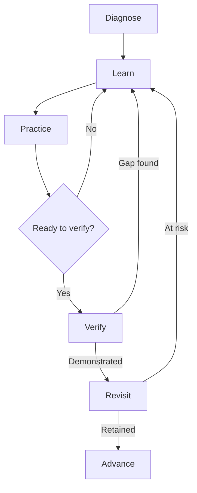

# AI Native Mastery Platform

**Product Requirements Document**

*Build credible skill mastery for learners regardless of connectivity*

| **Document**     | **Value**                                                                                                  |
|------------------|------------------------------------------------------------------------------------------------------------|
| Status           | Concept PRD for social-impact discovery, offline-first MVP planning, and Google Cloud prototype deployment |
| Version          | 0.10                                                                                                       |
| Date             | 18 September 2026                                                                                          |
| Primary audience | Product, design, engineering, learning science, and pilot partners                                         |
| Initial wedge    | Data Problem-Solving and Automation                                                                        |

## Working thesis

> Build an offline-first, AI-native learning system that helps learners with limited connectivity develop practical skills, demonstrate what they can do independently, and continue learning without depending on continuous internet access.

## Core promise

Make high-quality, evidence-based learning usable beyond well-connected classrooms. Help learners build, demonstrate, and retain practical capability without treating connectivity, device cost, or course completion as proxies for potential.

# 1 Executive Summary

Access to AI-enabled learning is expanding unevenly. Many products assume reliable broadband, capable devices, continuous cloud access, and prior familiarity with technical tools. Learners in rural and underserved communities may face unstable connectivity, expensive data, shared or low-memory devices, limited access to instructors, and fewer opportunities to demonstrate job-relevant skills. These constraints can exclude capable learners before learning begins and can widen existing education and opportunity gaps.

The proposed product is a Google Cloud-supported, offline-first mastery and evidence engine designed to reduce that access gap. Learners download a compact pathway when connectivity is available, then complete the core Diagnose, Learn, Practice, Verify, and Revisit loop on a personal device without an active connection. The system adapts to evidence and misconceptions, stores progress locally, distinguishes assisted learning from independent performance, and synchronizes through Firebase or Cloud Run when connectivity returns. Google Cloud extends the experience but is not required to complete the core loop after a module has been downloaded.

The MVP should validate two linked claims: first, that learners can complete a high-quality adaptive pathway on representative low-cost devices despite intermittent connectivity; second, that multi-modal evidence predicts independent performance better than course completion and conventional quiz scores. It should not attempt to become a general-purpose course catalog, credentialing body, employment evaluation system, or substitute for broader investments in teachers, devices, connectivity, and local education systems.

Generative AI is a substantive part of the learning and evidence experience. It acts as a misconception-aware tutor and qualitative evidence interpreter: it adapts explanations to the learner's error, creates bounded practice variations, asks follow-up questions about submitted work, and converts reasoning into reviewable evidence claims. It does not independently determine mastery. Deterministic validators, versioned rubrics, policy rules, and human escalation remain authoritative, and an authored fallback preserves the full learning loop when a suitable on-device model or connection is unavailable.

## Recommended first product

- Target learner: motivated adults in rural or underserved communities who need practical data skills but may face intermittent connectivity, limited device capacity, uneven formal preparation, or limited access to instructors.

- Initial pathway: Data Problem-Solving and Automation, beginning with data literacy and spreadsheets, progressing through SQL, and introducing scripting when automation adds clear value.

- Core experience: downloadable diagnostic assessment, adaptive learning plan, a misconception-aware GenAI tutor in Learning Mode, bounded practice variation, dynamic follow-up questions in Proof Mode, hands-on tasks, delayed retention checks, and an evidence-backed skill profile. Every GenAI feature has an authored or deterministic fallback.

- Access model: Android-first personal-device experience that completes the core loop offline, uses compact downloadable or physically transferable content packs, and synchronizes opportunistically when connectivity returns.

- Pilot design: one domain and 100–300 learners, including a meaningful cohort using representative low-cost devices and intermittent connectivity, with an external transfer task scored blind to the product's mastery estimate.

## Product decisions embedded in this PRD

| **Decision**        | **Recommendation**                                         | **Reason**                                                                                                                                                 |
|---------------------|------------------------------------------------------------|------------------------------------------------------------------------------------------------------------------------------------------------------------|
| Primary object      | Skill and evidence, not course completion                  | Keeps the product aligned to actual capability.                                                                                                            |
| Mastery output      | Calibrated confidence with evidence history                | Avoids false precision and makes claims auditable.                                                                                                         |
| Modes               | Separate Learning Mode and Proof Mode                      | Assistance is valuable for learning but weak evidence during verification.                                                                                 |
| Adaptation          | Choose activities for learning value and information value | The next activity should teach or resolve an important uncertainty.                                                                                        |
| Initial participant | Learner pilot focused on access and learning value         | Tests whether the experience is useful and reachable before adding institutional workflows.                                                                |
| Connectivity        | Personal-device offline use first; local hub later         | Validates the lowest-dependency access model before introducing hub operations.                                                                            |
| Human role          | Reviewer for disputed or high-stakes evidence              | AI scoring alone should not determine consequential decisions.                                                                                             |
| Cloud role          | Google Cloud-supported, not cloud-dependent                | Firebase or Cloud Run provides deployment, synchronization, content delivery, and online AI enhancements while downloaded learning remains usable offline. |

# 2 Problem Definition

## 2.1 Social and access problem

Learners do not receive equal access to high-quality adaptive learning. Rural location, unstable connectivity, expensive data, low-memory devices, limited instructor availability, and uneven prior preparation can restrict when and how a learner participates. Cloud-only AI experiences may reproduce these barriers by making continuous access a prerequisite rather than an enhancement.

## 2.2 Learning and evidence problem

Learners also cannot reliably tell which skills they understand, which they can apply without assistance, and which they are beginning to forget. Completion certificates and polished AI-assisted outputs may conceal specific misconceptions or weak independent performance, while static exams provide only a narrow snapshot.

## 2.3 System and program problem

- Education programs need credible, current evidence of capability without requiring invasive surveillance or permanent connectivity.

- Many digital learning experiences assume capable personal devices, reliable broadband, and continuous cloud services.

- Content and support are often centralized, making interruptions or high data costs disproportionately harmful to remote learners.

- Completion and time-on-task are treated as outcomes, while assessment often rewards recognition or memorization and rarely models prerequisite gaps, uncertainty, or forgetting.

- AI assistance is either banned indiscriminately or allowed without distinguishing supported production from independent capability; evidence remains fragmented across activities and time.

## 2.4 Social impact opportunity

Provide resilient learning infrastructure that continues working when the network does not. Give each learner a locally available pathway and a learner-controlled evidence record that answers: What can I do now? How strong is the evidence? What should I do next? When should this be checked again? The intended impact is greater access to future-ready skills and more credible demonstrations of capability for learners who are poorly served by cloud-dependent education.

## 2.5 Social impact boundary

The first pilot is English-only and cannot establish language inclusion or broad population impact. It must report who was reached, who was excluded, device and connectivity conditions, completion and transfer outcomes by access condition, and any burden shifted to learners or local facilitators. Offline delivery is one part of accessibility; it does not solve device affordability, disability access, local-language coverage, instructor shortages, or structural barriers on its own.

# 3 Product Vision and Principles

## 3.1 Vision

Learners should be able to develop and demonstrate practical capability regardless of whether they live near reliable broadband. Every learner has an adaptive tutor and an auditable skill profile that works through authentic practice and credible demonstration, while core learning and proof remain available without continuous internet access.

## 3.2 Product principles

| **Principle**                    | **Implication**                                                                                                                                   |
|----------------------------------|---------------------------------------------------------------------------------------------------------------------------------------------------|
| Evidence before labels           | Show why a skill is considered demonstrated or uncertain.                                                                                         |
| Learning and proof are different | Permit rich assistance in learning; constrain and record assistance in proof.                                                                     |
| Uncertainty is useful            | The system may say it lacks enough evidence and should seek the most informative next activity.                                                   |
| Transfer matters                 | Prefer novel application over repeated variants of memorized questions.                                                                           |
| Learner agency                   | Let learners inspect, challenge, and supplement their evidence.                                                                                   |
| Low-surveillance integrity       | Use task design, interaction evidence, and follow-up questioning before invasive monitoring.                                                      |
| Calibrated claims                | Report confidence bands and evidence quality; avoid false precision.                                                                              |
| Human accountability             | No consequential decision about a person should rely only on an AI-generated mastery result.                                                      |
| Access under constraint          | Design the core experience for intermittent connectivity and representative low-cost devices; treat cloud services as enhancement, not admission. |

# 4 Users and Jobs to Be Done

| **User**              | **Primary job**                                                                                                                | **Initial priority** |
|-----------------------|--------------------------------------------------------------------------------------------------------------------------------|----------------------|
| Learner               | Help me learn and demonstrate practical skills even when connectivity, device capacity, or instructor access is limited.       | Primary              |
| Instructor or mentor  | Show me where a learner is stuck and what evidence supports that conclusion.                                                   | Pilot support        |
| Program owner         | Determine whether the learning experience produces transferable capability.                                                    | Pilot partner        |
| Community facilitator | Help learners provision content, recover from access problems, and continue learning without requiring permanent connectivity. | Later research       |
| Content author        | Map resources and tasks to skills and evidence types.                                                                          | Internal first       |

## Primary persona

A motivated adult learner in a rural or underserved community who wants to use data to solve practical problems, improve work, or enter a technical career. They may rely on intermittent connectivity, a low-memory Android device, shared access to data or power, uneven formal preparation, and little or no prior programming experience.

## Primary job story

When connectivity and learning support are limited, I want to keep developing practical data and automation skills, understand what I can do independently, and preserve credible progress so my location or access conditions do not determine my opportunity to learn.

## 4.1 Initial Pathway

The MVP will launch with Data Problem-Solving and Automation. The pathway teaches learners to frame a practical question, inspect and validate data, calculate or query an answer, communicate the result, and automate repeatable work. It is deliberately broader than a single tool and narrower than a data-science occupation.

### Pathway progression

1\. Data foundations: tables, data types, missing values, validation, privacy, and evidence-based conclusions.

2\. Spreadsheet problem-solving: formulas, filters, summaries, charts, error checking, and reusable templates.

3\. SQL investigation: selecting, filtering, joining, grouping, and validating results against source records.

4\. Workflow automation: repeatable transformations, rule-based checks, and small scripts using an approved offline runtime.

5\. Applied projects: locally relevant scenarios such as inventory, crop or clinic records, school attendance, household budgeting, and service operations, using synthetic or properly governed data.

6\. Specialization bridges: learners may continue into software development, security operations, applied analytics, or AI-assisted work after demonstrating the relevant prerequisites.

### MVP boundary

The pilot covers spreadsheet-like tables, CSV files, SQL, and limited Python or JavaScript automation. It does not claim to train a data scientist, software engineer, or cybersecurity professional. Cloud deployment, unrestricted packages, production databases, offensive security tooling, and large-scale machine learning remain outside the initial pathway.

### Mastery evidence

Proof combines correct outputs with inspection of formulas or queries, validation checks, explanation of assumptions, recovery from planted errors, transfer to an unfamiliar dataset, and delayed reassessment. A polished chart or AI-generated script alone is not sufficient evidence of mastery.

### Offline sandbox

The learner device provides a constrained workspace with a table viewer, spreadsheet-like editor, SQL runner backed by a local database, and an optional prepackaged scripting runtime. Starter datasets, tests, hints, and project history are stored in the content pack. Execution has time and memory limits, external network access is disabled by default, and work synchronizes only when a connection or local hub becomes available.

# 5 The Mastery Model

## 5.1 Skill graph

The core content structure is a directed graph of observable skills and prerequisites. A course is a curated path through that graph, not the canonical source of truth. Skills must be narrow enough to assess through behavior, such as “clean inconsistent records and justify each transformation,” rather than broad labels such as “knows data analysis.”

| **Skill field**       | **Definition**                                                                     |
|-----------------------|------------------------------------------------------------------------------------|
| Skill statement       | An observable capability written as an action in a defined context.                |
| Prerequisites         | Skills whose absence materially reduces the chance of success.                     |
| Evidence requirements | Minimum mix of recall, explanation, application, transfer, and retention evidence. |
| Difficulty range      | Expected complexity and scaffolding levels.                                        |
| Misconceptions        | Known wrong models the system should diagnose.                                     |
| Assessment bank       | Validated prompts, tasks, rubrics, and variants.                                   |
| Resources             | Explanations, examples, videos, documentation, and practice mapped to the skill.   |

## 5.2 Mastery state

The learner-facing state should remain understandable while the internal model may be probabilistic.

| **State**    | **Meaning**                                                           | **Typical next action**     |
|--------------|-----------------------------------------------------------------------|-----------------------------|
| Unknown      | Not enough evidence to estimate current capability.                   | Short diagnostic            |
| Exposed      | The learner has encountered the idea but has not demonstrated it.     | Guided example              |
| Developing   | Some correct evidence exists, with important gaps or inconsistency.   | Targeted practice           |
| Demonstrated | The learner succeeds independently in representative contexts.        | Novel transfer task         |
| Mastered     | Multiple strong, recent, independent evidence items support transfer. | Advance and schedule review |
| At risk      | Earlier mastery evidence has aged or recent performance has declined. | Spaced retrieval check      |

## 5.3 Evidence model

Every evidence item records more than correctness. Its contribution depends on quality and context.

| **Dimension**    | **Examples**                                               |
|------------------|------------------------------------------------------------|
| Outcome          | Correctness, rubric score, partial credit, error class     |
| Independence     | Unassisted, hints used, AI used, collaborator present      |
| Cognitive demand | Recall, explain, apply, debug, design, transfer            |
| Novelty          | Seen pattern, variant, unfamiliar context                  |
| Recency          | When the evidence was collected                            |
| Consistency      | Agreement with other evidence across modalities            |
| Authenticity     | Interaction trace, follow-up explanation, artifact history |
| Rater confidence | Rubric reliability and model or human scoring confidence   |

A learner-facing mastery view should expose the evidence mix, most recent independent demonstration, known weaknesses, and next verification date. A numeric confidence may be shown only if calibrated and accompanied by plain-language meaning.

## 5.4 Next best activity policy

The selection engine balances five signals: expected learning gain, expected information gain, goal relevance, prerequisite leverage, and learner cost. It should also enforce variety and avoid repeatedly testing the same surface pattern.

Conceptual priority score: activity value = learning gain + information gain + goal relevance + prerequisite leverage − time and frustration cost. Initial MVP weights should be rules-based and observable; optimization can follow after sufficient outcome data exists.

# 6 Core Experience

## 6.1 Continuous loop

1. Diagnose: collect a compact baseline across prerequisites and target skills.

2. Learn: offer an explanation or resource suited to the learner's misconception and preference.

3. Practice: provide scaffolded activities with hints and feedback.

4. Verify: remove scaffolding, introduce a novel challenge, and collect independent evidence against an explicit rubric.

5. Revisit: schedule retrieval based on evidence strength, age, and observed decay.

The loop is not a fixed course sequence. It operates per skill. A learner may move directly from Diagnose to Verify when prior evidence is strong, return from Practice or Verify to Learn when a misconception appears, or revisit a previously mastered skill while continuing to develop other skills.

*Figure 1 Mastery loop transitions*

## 6.2 Learning Mode

Learning Mode is permissive and collaborative. Learners may ask questions, request alternate explanations, use examples, reveal hints, consult documentation, and work with the AI mentor. Activity events still record assistance so the system can distinguish learning progress from proof evidence.

## 6.3 Proof Mode

Proof Mode collects stronger evidence under declared constraints. It uses bounded sessions, novel tasks, randomized parameters, oral follow-ups, and artifact or interaction history. The interface tells the learner what assistance is allowed. A session may be paused or invalidated when the evidence cannot support the intended claim, but the learner should receive a clear reason and an appeal or retry path.

| **Proof method**   | **What it tests**                        | **Integrity mechanism**                            |
|--------------------|------------------------------------------|----------------------------------------------------|
| Adaptive questions | Recall and conceptual discrimination     | Item variation and follow-up on reasoning          |
| Oral explanation   | Mental model and independent reasoning   | Dynamic probes tied to prior answers               |
| Debugging task     | Diagnosis and application                | Novel defect and action trace                      |
| Hands-on build     | Integrated performance                   | Milestones, version history, and defense questions |
| Transfer scenario  | Generalization beyond practiced examples | Unfamiliar context with rubric-based scoring       |
| Delayed review     | Retention                                | Unannounced variant after an appropriate interval  |

## 6.4 Learner profile

- Goal and target role or outcome.

- Skill map with state, confidence language, and prerequisite relationships.

- Evidence timeline with modality, assistance level, rubric, date, and result.

- Misconceptions and skills requiring review.

- Recommended next activity with an explanation of why it matters.

- Learner controls to correct context, add evidence, request reassessment, or hide sharing.

## 6.5 Loop operation model

Every stage is a contract with an entry reason, a learner activity, evidence rules, and an exit decision. The next-best-activity policy selects a stage and activity for one or more skills; it does not simply advance the learner after completion.

| **Stage** | **Purpose**                                                | **Learner experience**                                                                     | **Evidence**                                                                      | **Exit decision**                                                         |
|-----------|------------------------------------------------------------|--------------------------------------------------------------------------------------------|-----------------------------------------------------------------------------------|---------------------------------------------------------------------------|
| Diagnose  | Estimate current capability and uncertainty                | Complete a short adaptive set of questions, explanations, or tasks                         | Correctness, reasoning, confidence, error pattern, difficulty, and assistance     | Identify a gap, establish readiness for Verify, or remain Unknown         |
| Learn     | Introduce a capability or correct a specific misconception | Use a targeted explanation, example, dialogue, or demonstration                            | Self-explanation and formative checks; not strong proof evidence                  | Pass a comprehension check or receive a different explanation             |
| Practice  | Build capability with progressively reduced support        | Complete varied exercises with feedback and optional hints                                 | Accuracy, consistency, error recovery, difficulty, and assistance used            | Meet a readiness rule, continue practice, or return to Learn              |
| Verify    | Test independent application and transfer                  | Complete a novel challenge under declared assistance constraints and explain the reasoning | Rubric score, independence, novelty, reasoning, provenance, and scorer confidence | Demonstrate the skill, collect more evidence, or return to a targeted gap |
| Revisit   | Test retention after time has passed                       | Complete a delayed retrieval or transfer task with meaningful variation                    | Retention interval, independence, transfer, and contradictory evidence            | Keep current, mark At risk, or reopen Learn or Practice                   |

## 6.6 Evidence processing after each activity

1. Record the result with skill, difficulty, novelty, permitted and actual assistance, time, modality, rubric, content version, and provenance.

2. Validate the evidence. Reject, quarantine, or request review when the activity is incomplete, corrupted, outside its permitted conditions, or scored with low confidence.

3. Update the mastery estimate. Independent novel evidence carries more weight than assisted practice; recent contradictory evidence can lower confidence.

4. Locate the remaining uncertainty. Distinguish whether the unresolved question concerns recall, explanation, application, transfer, retention, or evidence authenticity.

5. Select the next activity by expected learning gain, information gain, goal relevance, prerequisite leverage, learner cost, offline availability, and required modality.

The learner should see a concise reason for the selection. Example: You can summarize a clean table, but there is not enough evidence that you can detect and repair inconsistent records independently. Your next activity is an unassisted data-cleaning task.

## 6.7 Initial transition rules

The MVP uses transparent, versioned rules. A language model may help interpret an answer, but it does not control progression without the policy layer.

| **Current condition**                                                           | **Next stage**    | **Reason**                                                        |
|---------------------------------------------------------------------------------|-------------------|-------------------------------------------------------------------|
| Diagnostic reveals a misconception or missing prerequisite                      | Learn             | Target the specific explanatory gap before more testing           |
| Diagnostic provides strong recent independent evidence                          | Verify            | Confirm transfer without unnecessary instruction                  |
| Comprehension check succeeds                                                    | Practice          | Move from conceptual understanding to supported performance       |
| Practice remains inconsistent or hint-dependent                                 | Practice or Learn | Increase variation or repair the recurring misconception          |
| Practice succeeds across sufficiently difficult variants with little assistance | Verify            | Test whether performance transfers without scaffolding            |
| Verify meets the rubric with valid independent evidence                         | Revisit           | Schedule retention while unlocking eligible dependent skills      |
| Verify fails in a diagnosable way                                               | Learn or Practice | Remediate the demonstrated gap instead of repeating the same test |
| Delayed evidence is weak, old, or contradictory                                 | Revisit or Learn  | Refresh the skill and reduce overconfidence                       |

Thresholds are configuration, not universal truths. The team must calibrate readiness and mastery thresholds against blind-scored external transfer tasks and revise them by domain when evidence supports the change.

## 6.8 End to end example

Target skill: detect and repair inconsistent values in a small operational dataset.

| **Stage** | **What happens**                                                                                                                | **System decision**                                                                                                             |
|-----------|---------------------------------------------------------------------------------------------------------------------------------|---------------------------------------------------------------------------------------------------------------------------------|
| Diagnose  | The learner reviews an inventory table, notices duplicate item names, but treats inconsistent units as equivalent.              | Infer a misconception about data types and unit normalization, then select a targeted explanation.                              |
| Learn     | The learner studies a worked comparison of kilograms and grams, then explains why values must be normalized before aggregation. | A short comprehension check indicates that the misconception may be corrected.                                                  |
| Practice  | The learner cleans three datasets with decreasing hints, validates totals, and recovers from a planted formatting error.        | The readiness rule is met because varied datasets are corrected consistently with little assistance.                            |
| Verify    | The learner independently cleans an unfamiliar stock-count dataset, writes a summary query, and explains each transformation.   | The rubric supports Demonstrated because correctness, validation, independence, explanation, and transfer requirements are met. |
| Revisit   | Fourteen days later, the learner receives a clinic-supplies dataset with different unit and duplicate-record problems.          | Success keeps the skill current; partial success marks it At risk; failure reopens the relevant gap.                            |

## 6.9 Offline execution contract

- Diagnose uses downloaded items, rubrics, and deterministic adaptation rules.

- Learn always has an authored text-first resource; local AI is optional and may provide explanations or dialogue on capable hardware.

- Practice selection and mastery updates run locally and never depend on a network response.

- Verify uses locally available secure tasks, records permitted assistance, and appends evidence before showing completion.

- Revisit uses the local schedule and device notifications. The learner can complete it while still offline.

- Complex AI scoring may remain provisional until local-hub or cloud review, but progress and evidence are never discarded. Synchronization preserves the original event and policy versions.

## 6.10 Generative AI assisted learner journey

Generative AI changes the response to the learner rather than replacing the mastery engine. Each invocation receives a bounded skill definition, approved source excerpts, the relevant learner attempt, known misconceptions, permitted assistance, and an output constraint. The learner can inspect the resulting explanation or question, while the system records the model, prompt policy, source bundle, inference location, and assistance level.

| **Moment**      | **Generative AI contribution**                                                                             | **Authoritative control**                                                                                          |
|-----------------|------------------------------------------------------------------------------------------------------------|--------------------------------------------------------------------------------------------------------------------|
| Diagnose        | Interpret explanations or work traces and propose likely misconceptions.                                   | Validated items and deterministic checks establish correctness; model labels remain hypotheses.                    |
| Learn           | Create a targeted explanation, analogy, example, or short Socratic exchange grounded in approved material. | The authored lesson is always available; the model may not introduce unapproved learning objectives.               |
| Practice        | Generate bounded variants and progressive hints based on the current error pattern.                        | Templates, validators, difficulty limits, and assistance logging constrain the activity.                           |
| Verify          | Ask a dynamic defense question tied to the learner's artifact or reasoning.                                | Novel task selection, allowed assistance, rubric scoring, and mastery transitions remain versioned and reviewable. |
| Evidence review | Transform qualitative responses into structured, traceable evidence claims with uncertainty.               | Rules combine evidence; low-confidence or consequential cases require human review.                                |

Offline hierarchy. Low-cost or unsupported devices use authored explanations, pre-generated variants, and deterministic feedback. Supported devices may use short, single-turn on-device generation. Connected sessions may use richer Gemini dialogue, multimodal review, or speech. Loss of either the model or the network must degrade the experience, not block it.

# 7 Primary User Flows

## 7.1 New learner

1. Select a concrete goal and initial module.

2. Review what data will be collected and how evidence may be used.

3. Complete a 15–25 minute adaptive diagnostic.

4. Receive a skill map that distinguishes observed evidence from unknown areas.

5. Start the recommended learning activity and see why it was chosen.

6. Complete an independent challenge after enough guided practice.

7. Review the evidence-backed result and scheduled follow-up.

## 7.2 Daily return

The learner sees one recommended action, its expected duration, whether it is for learning or proof, and the reason it is prioritized. They may choose an alternative while the system records preference and adapts within goal constraints.

## 7.3 Instructor review

An instructor inspects cohort-level gaps and individual evidence, filters low-confidence or disputed assessments, and can annotate or override a result with a reason. Overrides remain visible in the audit history.

## 7.4 Prototype demonstration flow

The working prototype must demonstrate that Google Cloud integration and offline accessibility reinforce rather than contradict each other. The evaluator flow is:

1.  Connect and download a compact Data Problem-Solving and Automation module.

2.  Disconnect the device from the internet.

3.  Complete representative Diagnose, Learn, Practice, Verify, and Revisit activities while progress and evidence are committed locally.

4.  Reconnect and synchronize progress through Firebase or a Cloud Run service.

5.  Show at least one meaningful Gemini or Gemma capability, such as targeted explanation, evidence review, or content-pack preparation.

6.  Confirm that no completed learning evidence is lost across interruption and synchronization.

# 8 Offline First and Rural Deployment

## 8.1 Product requirement

A learner must be able to complete the core Diagnose, Learn, Practice, Verify, and Revisit loop without an active internet connection. Important actions are committed locally before any network request. Connectivity enhances the experience but must not be required to open downloaded material, save progress, complete eligible assessments, update the local mastery state, or schedule review.

## 8.2 Deployment model

| **Layer**               | **Offline responsibility**                                                                           | **Connected responsibility**                                                                            |
|-------------------------|------------------------------------------------------------------------------------------------------|---------------------------------------------------------------------------------------------------------|
| Learner device          | Content, activities, local profile, evidence log, mastery updates, sync queue, and optional small AI | Download updates, back up events, and receive reviewed results                                          |
| School or community hub | Local Wi-Fi access, shared content, teacher dashboard, device sync, backups, and optional shared AI  | Exchange compact updates with central services when a connection is available                           |
| Cloud services          | Not required for an active offline session                                                           | Content publishing, cross-site synchronization, stronger AI, human review, analytics, and model updates |
| Physical media          | Distribute signed content, model, and software bundles by USB, SD card, or portable drive            | Prepared from an authorized connected environment                                                       |

## 8.3 Hardware tiers

| **Tier**                | **Expected experience**                                                                  | **Product behavior**                                                        |
|-------------------------|------------------------------------------------------------------------------------------|-----------------------------------------------------------------------------|
| Low-cost phone          | Text, compressed images, quizzes, deterministic adaptation, progress, and selected audio | AI is optional; fall back to authored explanations and rule-based scoring   |
| Capable phone or tablet | Core experience plus a small local language model for hints and constrained dialogue     | Display model download size and permit removal without losing learning data |
| Local learning hub      | Shared content library, classroom dashboard, local sync, and more capable AI services    | Continue serving devices over local Wi-Fi when the internet is unavailable  |
| Connected environment   | Full synchronization, difficult scoring, human review, and large updates                 | Never block offline work while cloud processing is pending                  |

## 8.4 Synchronization and distribution

- Use an append-only evidence log with stable event identifiers so retries do not duplicate progress.

- Prioritize small evidence and profile updates before content, video, or model downloads.

- Resume interrupted transfers and show pending, synchronized, failed, and conflict states in plain language.

- Version skills, activities, rubrics, policies, content packs, and AI models; preserve the version used for historical evidence.

- Support internet, local-network peer, school-hub, USB, SD-card, and portable-drive update paths.

- Resolve ordinary progress merges automatically; route contradictory profile or scoring changes for review.

## 8.5 Offline Proof Mode limitations

Offline Proof Mode can produce credible evidence through novel tasks, randomized parameters, interaction history, oral defense, delayed reassessment, and a device-signed event log. It cannot guarantee identity or the absence of outside help. Learner-facing claims must describe the recorded conditions. High-impact evidence may remain provisional until it is synchronized, validated, or reviewed.

## 8.6 Rural accessibility requirements

- Android-first support with testing on representative older and low-memory devices.

- Text-only and low-data content packs, transcripts, compressed media, and visible download sizes.

- No progress loss during power interruption, application termination, or unstable connectivity.

- Battery-aware synchronization and configurable Wi-Fi-only downloads.

- Local-language content packs and equivalent non-voice paths where speech models are unavailable or unreliable.

- Administrators can provision multiple devices locally without requiring individual high-bandwidth downloads.

## 8.7 Google Cloud supported offline architecture

The product uses a local-first execution boundary. Cloud services are meaningful parts of the prototype, but temporary loss of connectivity must not block the downloaded core learning loop.

- Learner device: stores downloaded content packs, local mastery state, activity events, pending evidence, and scheduled reviews. Eligible activities and deterministic adaptation rules run without a network connection.

- Firebase: may host the web or PWA shell, manage authentication, distribute versioned content packs, and synchronize learner-controlled records when a connection returns.

- Cloud Run: may provide heavier Gemini services, content-pack preparation, complex or provisional evidence review, analytics, and conflict-resolution support.

- Gemma or equivalent on-device model: may provide bounded offline explanations or coaching when feasible on the supported device tier. A deterministic non-generative fallback must remain available when local inference is unsupported.

- Synchronization boundary: connected services receive versioned events rather than replacing the local record. The client shows pending, synchronized, failed, and conflict states and never silently discards accepted offline work.

# 9 MVP Scope

## 9.1 In scope

| **Capability**                               | **MVP requirement**                                                                                                                                                                                                                                                 |
|----------------------------------------------|---------------------------------------------------------------------------------------------------------------------------------------------------------------------------------------------------------------------------------------------------------------------|
| Skill graph                                  | Data Problem-Solving and Automation with 30–60 observable skills spanning data foundations, spreadsheets, SQL, and limited scripting.                                                                                                                               |
| Diagnostic                                   | Adaptive baseline using a bounded item and task bank.                                                                                                                                                                                                               |
| AI mentor                                    | Dialogue grounded in approved resources, skills, and misconceptions.                                                                                                                                                                                                |
| Adaptive practice                            | Rules-based activity selection with transparent reasons.                                                                                                                                                                                                            |
| Proof Mode                                   | Adaptive quiz, oral explanation, and one hands-on task type.                                                                                                                                                                                                        |
| Mastery estimate                             | Evidence-weighted state with uncertainty and decay.                                                                                                                                                                                                                 |
| Evidence record                              | Timestamped events with rubric, assistance, provenance, and scorer confidence.                                                                                                                                                                                      |
| Dashboard                                    | Learner skill map; basic instructor review queue and cohort summary.                                                                                                                                                                                                |
| Retention                                    | At least one delayed reassessment schedule.                                                                                                                                                                                                                         |
| Evaluation                                   | External transfer task and calibration analysis.                                                                                                                                                                                                                    |
| Offline operation                            | Android-first local data, downloadable content pack, sync queue, and resilient restart.                                                                                                                                                                             |
| Future hub readiness                         | Content, evidence, and synchronization formats remain compatible with a later local hub, but hub hardware and operations are not required for the first deployment.                                                                                                 |
| Offline sandbox                              | Constrained table, SQL, and scripting workspace with starter datasets, deterministic tests, local project history, resource limits, and no external network access by default.                                                                                      |
| Google Cloud prototype deployment            | Deploy a functional client through Firebase or Cloud Run, use Firebase or Cloud Run for real synchronization or online processing, and integrate a meaningful Gemini or Gemma capability. The downloaded core loop must remain usable when the network is disabled. |
| Generative AI tutor and evidence interpreter | Use Gemini or Gemma to generate grounded targeted explanations, bounded hints or variants, dynamic follow-up questions, and reviewable evidence interpretations. Preserve authored fallbacks and keep mastery decisions outside the generative model.               |

## 9.2 Explicitly out of scope

- AI-generated video production as a core capability.

- A broad catalog of unrelated courses or mentors.

- Accredited certification or claims equivalent to a degree or professional license.

- Employment screening, worker evaluation, or other consequential decision integrations.

- Remote proctoring based on face, gaze, emotion, or biometric inference.

- Open-ended assessment of every professional domain.

- Fully autonomous generation and release of high-stakes assessment items.

- Public skill profiles by default.

- Requiring an on-device generative model for the core learning loop.

- High-quality AI video generation on learner devices.

## 9.3 MVP assumptions

- The first domain can be decomposed into observable skills with usable rubrics.

- A short interaction history plus dynamic follow-ups can provide useful integrity signals without invasive surveillance.

- Learners accept separate assisted and independent modes when the benefit is clearly explained.

- Pilot partners can provide or approve source material, tasks, and an external outcome measure.

- The pilot can obtain representative low-cost Android devices and at least one local-hub configuration for field testing.

# 10 Functional Requirements

| **ID** | **Requirement**                                                                                                                                                           | **Priority** |
|--------|---------------------------------------------------------------------------------------------------------------------------------------------------------------------------|--------------|
| FR1    | Create and version skills, prerequisites, misconceptions, rubrics, resources, and evidence requirements.                                                                  | Must         |
| FR2    | Run a diagnostic that adapts difficulty and skill coverage while respecting a time budget.                                                                                | Must         |
| FR3    | Recommend one next activity and display a learner-readable reason.                                                                                                        | Must         |
| FR4    | Support Learning Mode with grounded explanations, hints, examples, and feedback.                                                                                          | Must         |
| FR5    | Support Proof Mode with declared assistance constraints and evidence capture.                                                                                             | Must         |
| FR6    | Score structured and open responses against versioned rubrics, with confidence and review thresholds.                                                                     | Must         |
| FR7    | Update mastery state only from valid evidence and preserve the full event history.                                                                                        | Must         |
| FR8    | Schedule reassessment based on elapsed time, prior strength, and recent contradictory evidence.                                                                           | Must         |
| FR9    | Allow learners to inspect evidence, request a retry, and dispute a scored result.                                                                                         | Must         |
| FR10   | Provide reviewer queues for low-confidence, disputed, or high-impact evidence.                                                                                            | Should       |
| FR11   | Export a learner-controlled evidence summary with scope and limitations.                                                                                                  | Should       |
| FR12   | Support human-authored and approved content before allowing generated assessment content.                                                                                 | Must         |
| FR13   | Complete the core learning and mastery loop without an active internet connection.                                                                                        | Must         |
| FR14   | Persist local events before network submission and synchronize them idempotently when connectivity returns.                                                               | Must         |
| FR15   | Download, verify, update, and remove versioned content packs without deleting learner evidence.                                                                           | Must         |
| FR16   | Distribute approved updates through cloud, local hub, peer network, or physical media.                                                                                    | Should       |
| FR17   | Provide deterministic non-AI fallbacks for explanations, recommendations, and eligible scoring.                                                                           | Must         |
| FR18   | Show offline availability, storage cost, update status, and pending synchronization clearly.                                                                              | Must         |
| FR19   | Apply versioned stage-transition rules and record the reason for every next-stage and next-activity decision.                                                             | Must         |
| FR20   | Run approved spreadsheet-like, SQL, and scripting activities offline in a constrained sandbox and record commands, revisions, tests, assistance, and outputs as evidence. | Must         |
| FR21   | Generate a targeted explanation from an approved source bundle, detected misconception, learner attempt, and declared reading level.                                      | Must         |
| FR22   | Generate bounded hints or practice variants without revealing protected answers or changing the skill objective.                                                          | Should       |
| FR23   | Generate a follow-up question tied to the learner's submitted artifact or explanation and record that AI assistance occurred.                                             | Must         |
| FR24   | Return traceable evidence interpretations with model, policy, source bundle, inference location, uncertainty, and review status.                                          | Must         |
| FR25   | Select authored, on-device, or cloud GenAI behavior from explicit capability and connectivity checks, with no hidden dependency on cloud inference.                       | Must         |

# 11 Nonfunctional Requirements

| **Area**           | **Requirement**                                                                                                                                                                                                      |
|--------------------|----------------------------------------------------------------------------------------------------------------------------------------------------------------------------------------------------------------------|
| Explainability     | Every mastery update and recommendation must be traceable to evidence and a policy version.                                                                                                                          |
| Latency            | Conversational feedback should begin within 3 seconds; complex scoring may complete asynchronously with status.                                                                                                      |
| Reliability        | No evidence event may be silently lost; scoring retries must be idempotent.                                                                                                                                          |
| Accessibility      | Target WCAG 2.2 AA, keyboard navigation, captions or transcripts, and equivalent non-voice alternatives.                                                                                                             |
| Privacy            | Private by default, purpose-limited collection, configurable retention, deletion, and export.                                                                                                                        |
| Security           | Encryption in transit and at rest, tenant isolation, role-based access, and audit logs.                                                                                                                              |
| Model governance   | Version prompts, models, rubrics, and policies; support rollback and retrospective evaluation.                                                                                                                       |
| Localization       | Architecture supports future localized content and rubrics; the first pilot is English only.                                                                                                                         |
| Offline resilience | No completed response or accepted evidence may be lost after power loss, process termination, or interrupted synchronization.                                                                                        |
| Data efficiency    | Prioritize compact event sync; make large downloads explicit, resumable, and optionally Wi-Fi-only.                                                                                                                  |
| Device support     | Set and test minimum Android, memory, storage, and performance targets using representative rural-deployment hardware.                                                                                               |
| Cloud deployment   | The prototype is deployed on Google Cloud through Firebase or Cloud Run. Cloud unavailability must not prevent opening downloaded content, saving eligible work, updating local mastery state, or scheduling review. |

# 12 AI and Data Design

## 12.1 AI responsibilities

| **Component**        | **AI role**                                                                                                             | **Required guardrail**                                                                                         |
|----------------------|-------------------------------------------------------------------------------------------------------------------------|----------------------------------------------------------------------------------------------------------------|
| Tutor                | Generate grounded, misconception-specific explanations, questions, examples, and feedback from bounded learner context. | Approved source bundle, prompt version, assistance logging, short-output limit, and authored offline fallback. |
| Activity selector    | Rank eligible next activities.                                                                                          | Use observable features and log the reason; begin with rules.                                                  |
| Assessment generator | Draft controlled variants from approved templates; never release high-stakes items autonomously.                        | Human-approved blueprint, leakage checks, and item review sampling.                                            |
| Scorer               | Interpret open responses and oral transcripts into rubric-linked evidence claims with uncertainty.                      | Confidence threshold, second-pass checks, and human escalation.                                                |
| Mastery updater      | Combine evidence into a current estimate.                                                                               | Run locally through a calibrated, versioned model with monotonic and policy constraints.                       |
| Integrity assistant  | Identify inconsistencies and trigger follow-up questions.                                                               | Never infer deception from identity, emotion, gaze, or accent.                                                 |

## 12.2 Generative AI operating model

The primary learner-facing GenAI capability is misconception-aware tutoring. The primary evidence capability is dynamic probing and qualitative evidence interpretation. These uses are substantive because the generated response depends on the learner's actual reasoning and changes the next interaction. Generic chat, decorative summaries, or a disconnected chatbot do not satisfy this requirement.

| **Capability**       | **Bounded input**                                               | **Expected output**                                               | **Decision authority**                             |
|----------------------|-----------------------------------------------------------------|-------------------------------------------------------------------|----------------------------------------------------|
| Targeted tutor       | Skill, misconception, attempt, approved excerpts, reading level | Explanation, analogy, worked example, comprehension question      | Advisory; authored lesson remains available        |
| Practice assistant   | Skill template, constraints, recent errors, hint budget         | Variant, hint, feedback, or counterexample                        | Validators determine correctness and readiness     |
| Proof probe          | Submitted artifact, action trace, rubric dimension              | One focused follow-up question                                    | Rubric and review policy determine evidence weight |
| Evidence interpreter | Response, artifact summary, provenance, rubric                  | Claims, supporting observations, uncertainty, escalation flag     | Mastery updater accepts only policy-valid evidence |
| Authoring assistant  | Approved curriculum and assessment blueprint                    | Draft explanation, item variant, rubric language, or audio script | Human approval required before release             |

Generation controls. Prompts and source bundles are versioned. Cloud responses should use schema-constrained output where supported. On-device Android generation is treated as optional and capability-gated because current Firebase AI hybrid support is experimental, device-limited, single-turn, and does not support structured output. A parser may validate simple local responses, but failure must route to an authored fallback rather than silently invoking cloud inference while the learner believes the session is offline.

## 12.3 Core entities

| **Entity**     | **Selected fields**                                                                                |
|----------------|----------------------------------------------------------------------------------------------------|
| Skill          | id, statement, domain, prerequisites, level, version                                               |
| Activity       | skills, modality, difficulty, duration, mode, allowed assistance                                   |
| Evidence event | learner, skill, outcome, rubric, independence, novelty, timestamp, provenance                      |
| Mastery state  | learner, skill, state, probability range, updated time, policy version                             |
| Misconception  | skill, diagnostic signals, remediation links                                                       |
| Recommendation | candidate set, selected activity, reason, policy version                                           |
| Stage decision | current stage, trigger evidence, eligible transitions, selected transition, reason, policy version |
| Review         | trigger, reviewer, decision, rationale, prior and revised score                                    |
| Sync event     | event id, device, local sequence, payload version, status, attempts, acknowledgment                |
| Content bundle | bundle id, locale, skills, version, size, manifest, signature, dependencies                        |

## 12.4 Initial mastery implementation

Start with an interpretable evidence-weighting model rather than an opaque end-to-end predictor. Correct independent transfer evidence should carry more weight than assisted practice. Contradictory recent evidence should reduce confidence. Older evidence should decay at a skill-specific rate. Prerequisites may influence recommendations, but a weak prerequisite should not automatically overwrite direct evidence for a downstream skill.

Once the pilot produces enough longitudinal data, compare Bayesian knowledge tracing, item-response approaches, and learned sequence models. Promotion should require better calibration and prediction of external transfer—not merely higher fit to internal quiz outcomes.

## 12.5 Content and assessment quality

- Maintain a human-approved assessment blueprint specifying skill coverage and cognitive demand.

- Version rubrics and preserve the rubric used for every historical score.

- Measure item difficulty, discrimination, exposure, ambiguity, and differential performance.

- Keep a secure holdout bank for transfer evaluation and refresh compromised items.

- Do not train or tune on the same responses used for final claims without a documented split.

## 12.6 Google AI deployment boundary

The prototype must use Gemini, Gemma, or an eligible Google agentic platform for a substantive product capability. Integration is substantive when the model changes an explanation, review, recommendation, or content artifact that a learner or reviewer can inspect. A logo, unused endpoint, or cloud-hosted static page does not meet this intent.

Cloud AI outputs that affect mastery evidence remain versioned, reviewable, and distinguishable from deterministic local decisions. When a cloud-only review is unavailable, the device preserves the evidence as pending or provisional and allows the learner to continue with eligible offline work.

# 13 Trust Integrity and Responsible Use

## 13.1 Integrity posture

The product should acknowledge that perfect authorship detection is not possible. It should make bounded claims about the conditions under which evidence was collected. Strong proof comes from converging behavior: solving, explaining, responding to novel probes, and retaining the skill—not from a single detector score.

## 13.2 Learner rights

- Know whether an activity is for learning, practice, or proof.

- Know what assistance is allowed and what data is collected.

- See the evidence behind a mastery claim and the limitations of that claim.

- Challenge an automated score and obtain human review where consequences are meaningful.

- Control sharing and revoke access to a profile where contractually and legally possible.

- Use an equivalent alternative when voice or a specific modality creates an accessibility barrier.

## 13.3 Product boundary

The product is a learner-facing education and mastery system. It will not provide applicant screening, hiring recommendations, worker evaluation, promotion decisions, or automated eligibility decisions. Mastery evidence is designed to guide learning and reflection, not to rank people for consequential external decisions.

# 14 Success Metrics and Validation

## 14.1 North star

Verified durable mastery: the proportion of target skills that a learner demonstrates independently on a novel task and retains at a delayed check. This is more meaningful than lessons completed or time spent.

## 14.2 Metric hierarchy

| **Category**        | **Metric**                                                                                                                  | **MVP target or decision rule**                                                                   |
|---------------------|-----------------------------------------------------------------------------------------------------------------------------|---------------------------------------------------------------------------------------------------|
| Validity            | Correlation or predictive performance against blind-scored external transfer tasks                                          | Materially outperform completion and conventional quiz-score baselines                            |
| Calibration         | Observed success by predicted mastery band; Brier score or expected calibration error                                       | No material overconfidence; predefine acceptable calibration bands                                |
| Learning            | Pre-to-post gain on secure equivalent forms                                                                                 | Positive gain versus comparison condition                                                         |
| Retention           | Delayed independent performance after 2–4 weeks                                                                             | Better retention than baseline experience                                                         |
| Efficiency          | Verified mastery gained per learner hour                                                                                    | Improve without lowering external performance                                                     |
| Coverage            | Share of mastery claims supported by more than one evidence modality                                                        | At least 70% for claims shown as Mastered                                                         |
| Trust               | Learner-reported clarity and fairness; dispute and overturn rates                                                           | Monitor by group and modality                                                                     |
| Engagement          | Diagnostic completion, weekly active learning, return for spaced review                                                     | Secondary; never substitute for validity                                                          |
| Offline reliability | Sessions completed without internet, recovery after interruption, and unsynchronized-event loss                             | No accepted evidence loss; predefined crash-recovery and sync-success gates                       |
| Access efficiency   | Data transferred, storage used, battery impact, and time to provision a learner                                             | Meet targets on representative low-cost hardware and intermittent networks                        |
| Reach               | Eligible learners who can install, provision, and begin the pathway under target device and connectivity conditions         | Predefine a successful-access threshold and report failure reasons by device and access condition |
| Access parity       | Difference in completion, verified mastery, and retention between intermittent-connectivity and reliably connected learners | No material disadvantage after accounting for baseline skill and declared learner context         |
| Learner burden      | Data cost, storage, battery use, travel or facilitator dependence, and time lost to synchronization                         | Stay within predefined field-tested limits and do not shift hidden operating costs to learners    |

## 14.3 Pilot hypotheses

| **Hypothesis**                                                        | **Test**                                                                                                                                                         | **Pass signal**                                                                                                              |
|-----------------------------------------------------------------------|------------------------------------------------------------------------------------------------------------------------------------------------------------------|------------------------------------------------------------------------------------------------------------------------------|
| The mastery model predicts transfer better than completion.           | Compare external-task prediction using mastery estimate, quiz score, and completion.                                                                             | Pre-registered improvement with uncertainty reported.                                                                        |
| Adaptive selection improves efficiency.                               | Randomize adaptive path versus fixed sequence.                                                                                                                   | Equal or better transfer performance in less time.                                                                           |
| Multi-modal evidence improves calibration.                            | Ablate oral, hands-on, and delayed evidence.                                                                                                                     | Full model reduces calibration error on holdout learners.                                                                    |
| Proof Mode distinguishes assisted output from independent capability. | Compare Learning Mode artifacts with novel Proof Mode tasks.                                                                                                     | Meaningful within-learner separation where assistance was substantial.                                                       |
| Learners accept the distinction between modes.                        | Interview and survey after use.                                                                                                                                  | Most learners understand the purpose and view constraints as proportionate.                                                  |
| Offline access preserves outcomes.                                    | Compare offline-first and connected cohorts on equivalent content and proof tasks.                                                                               | No material loss in transfer performance after accounting for learner context.                                               |
| Personal-device offline delivery broadens successful access.          | Measure installation, provisioning, completion, learner burden, and failure modes under representative low-cost-device and intermittent-connectivity conditions. | Target learners can complete the core loop without a hub and without unacceptable data, storage, battery, or support burden. |

## 14.4 Guardrail metrics

- False-confidence rate: learners labeled Mastered who fail the external task.

- Group calibration gaps and accessibility-related completion gaps.

- Automated-score disagreement with trained human raters.

- Dispute rate, review latency, and score-overturn rate.

- Hallucinated or unsupported tutor responses per audited session.

- Assessment leakage, repeated item exposure, and compromised-task rate.

- Learner stress, perceived surveillance, and withdrawal attributed to Proof Mode.

- Lost or duplicated evidence events, unresolved sync conflicts, and days of unsynchronized data.

- Performance, battery, storage, and failure rates by supported device tier.

# 15 Analytics and Experimentation

Events should support reconstruction of the learner journey without capturing unnecessary sensitive data. Minimum events include activity recommended, activity started, assistance requested, response submitted, rubric scored, evidence accepted or rejected, mastery updated, recommendation overridden, review requested, review decided, and retention check completed.

Experiments must separate learning outcomes from engagement. A feature that increases session length but reduces transfer or increases overconfidence is a failure. Analysis plans should be written before viewing results for core validity claims.

# 16 Delivery Plan

| **Phase**                | **Duration** | **Deliverable**                                                                                                                            | **Exit criterion**                                                                                           |
|--------------------------|--------------|--------------------------------------------------------------------------------------------------------------------------------------------|--------------------------------------------------------------------------------------------------------------|
| 0 Discovery              | 3–4 weeks    | Pathway decomposition, social-impact problem validation, learner research, sandbox feasibility, access constraints, and pilot dataset plan | Bounded module, measurable external outcome, intended learner profile, and target access conditions approved |
| 1 Instrumented prototype | 6–8 weeks    | Offline diagnostic, mentor fallback, evidence schema, local persistence, manual review, and skill map                                      | End-to-end offline sessions run with 15–30 learners on representative devices and connectivity conditions    |
| 2 Pilot MVP              | 8–12 weeks   | Proof Mode, mastery updater, content packs, personal-device synchronization, retention, and instructor review                              | 100–300 learner pilot completed with meaningful representation of the intended rural or underserved cohort   |
| 3 Validation             | 4–6 weeks    | Calibration, transfer, subgroup, and qualitative findings                                                                                  | Go, revise, or stop decision against pre-registered gates                                                    |
| 4 Productization         | TBD          | Authoring tools, tenant controls, stronger review operations                                                                               | Only after validity and demand are supported                                                                 |

# 17 Risks and Mitigations

| **Risk**                                     | **Why it matters**                                                                                                 | **Mitigation**                                                                                                                                                                |
|----------------------------------------------|--------------------------------------------------------------------------------------------------------------------|-------------------------------------------------------------------------------------------------------------------------------------------------------------------------------|
| False mastery confidence                     | A polished score could overstate real capability.                                                                  | Calibrate to external tasks, show uncertainty, require converging evidence.                                                                                                   |
| AI scoring inconsistency                     | Equivalent answers may receive different judgments.                                                                | Versioned rubrics, repeated scoring checks, human review thresholds.                                                                                                          |
| Assessment leakage                           | Generated or reused tasks may become searchable or memorized.                                                      | Secure holdouts, variants, exposure tracking, dynamic defense questions.                                                                                                      |
| Goodhart's law                               | Learners optimize the score rather than the capability.                                                            | Use varied novel tasks and keep outcome evaluation separate.                                                                                                                  |
| Bias and accessibility                       | Voice, language, disability, or culture may affect performance unrelated to skill.                                 | Alternate modalities, subgroup calibration, accommodations, appeal.                                                                                                           |
| Surveillance creep                           | Integrity features can become invasive and damage trust.                                                           | Prohibit biometric or emotion inference; minimize collection and state limits.                                                                                                |
| Content quality                              | Incorrect explanations or ambiguous questions teach the wrong thing.                                               | Approved sources, authoring workflow, audit sampling, issue reporting.                                                                                                        |
| Cold start                                   | The model lacks enough evidence for a new learner or skill.                                                        | Explicit Unknown state, compact diagnostic, conservative claims.                                                                                                              |
| Out-of-scope consequential use               | Learning evidence could be repurposed to rank or evaluate people outside the intended educational context.         | Prohibit consequential decision integrations, minimize external claims, preserve learner control, and enforce purpose limitations.                                            |
| Cost and latency                             | Voice, long context, and repeated scoring can be expensive.                                                        | Tiered models, caching, structured rubrics, asynchronous review.                                                                                                              |
| Low-end device limits                        | Local AI, media, or large content packs may exceed memory, storage, or battery capacity.                           | Hardware tiers, small bundles, authored fallbacks, hub inference, and field benchmarks.                                                                                       |
| Sync failure                                 | Long offline periods or retries may lose, duplicate, or conflict with evidence.                                    | Append-only event log, stable IDs, acknowledgments, resumable transfer, and conflict review.                                                                                  |
| Unequal experience                           | Connected learners may receive stronger AI or faster review than offline learners.                                 | Measure outcome parity, keep core pathways equivalent, and disclose pending enhanced review.                                                                                  |
| Hub operations                               | Local servers can fail or become difficult for schools to maintain.                                                | Simple appliance design, health checks, replaceable storage, administrator training, and offline recovery media.                                                              |
| Cloud dependency weakens the offline promise | A prototype can appear offline-first while essential AI, saving, or verification still fails without a connection. | Test the complete downloaded core loop in airplane mode, treat cloud review as pending rather than blocking, and demonstrate recovery and synchronization after reconnecting. |

# 18 Product Decision Register

Decided items are approved product constraints. Recommended items remain proposals until confirmed through discovery, feasibility testing, or pilot governance review.

| **Decision**                        | **Options**                                                                                                                                        | **Direction**                                                                                                                                                                                                                                                                                           |
|-------------------------------------|----------------------------------------------------------------------------------------------------------------------------------------------------|---------------------------------------------------------------------------------------------------------------------------------------------------------------------------------------------------------------------------------------------------------------------------------------------------------|
| **1 First pilot module**            | A. Inventory and small-business operations; B. Community-service records; C. Personal finance and budgeting.                                       | Recommended: A. It supports realistic spreadsheet, SQL, validation, and automation tasks using safe synthetic data, with broad relevance and clear transfer measures.                                                                                                                                   |
| 2 Initial participant               | Learner; instructor-led cohort; community learning program; university learning program.                                                           | Decided: Learner. Begin with direct learner access and learning value; treat education institutions only as possible later delivery or support partners.                                                                                                                                                |
| **3 Mastery threshold**             | A. One universal score; B. Fully domain-specific thresholds; C. Shared evidence minimum plus domain-specific rubric thresholds.                    | Recommended: C. Require common evidence qualities such as independence, novelty, and retention, then calibrate task thresholds for each skill domain.                                                                                                                                                   |
| **4 Proof Mode friction**           | A. Minimal constraints; B. Moderate bounded sessions and dynamic follow-ups; C. High-control remote proctoring.                                    | Recommended: B. Use novel tasks, declared assistance rules, interaction history, and short defense questions; avoid biometric or surveillance-heavy controls.                                                                                                                                           |
| **5 Retention interval**            | A. 7 days; B. 14 days; C. 28 days; D. Multiple intervals.                                                                                          | Recommended: D, with day 14 as the primary MVP outcome and day 28 as a smaller durability check where pilot duration permits.                                                                                                                                                                           |
| **6 Evidence portability**          | A. Product-only report; B. Learner-controlled signed export; C. Immediate adoption of an external credential standard; D. Defer portability.       | Recommended: B. Export a human-readable summary plus signed structured evidence; map to external standards only after the evidence model stabilizes.                                                                                                                                                    |
| **7 Mandatory human review**        | A. Review every open response; B. Review only disputes; C. Review low-confidence, disputed, high-impact, and sampled cases.                        | Recommended: C. Target review within three business days during the pilot and audit a random sample of otherwise accepted automated decisions.                                                                                                                                                          |
| **8 Data retention**                | A. Indefinite retention; B. Fixed short retention; C. Active-account retention plus deletion after inactivity; D. Learner-selected retention only. | Recommended: C. Retain while active, default to deletion 24 months after inactivity, and provide export and deletion controls subject to documented legal obligations.                                                                                                                                  |
| **9 Minimum device profile**        | A. Android 8 with 2 GB RAM; B. Android 10 with 3 GB RAM and 2 GB free storage; C. Android 12 with 4 GB RAM.                                        | Recommended: B as the supported baseline, while testing a reduced text-and-SQL experience on selected 2 GB devices before making a broader claim.                                                                                                                                                       |
| **10 First deployment model**       | Personal-device offline use; school or community hubs; both from launch.                                                                           | Decided: Personal-device offline use. Design formats for future hubs, but do not make hub hardware or administration an MVP dependency.                                                                                                                                                                 |
| **11 Pilot language**               | English only; English plus Filipino; English plus multiple local languages.                                                                        | Decided: English only for the pilot. Preserve localization architecture and equivalent non-voice paths for later expansion.                                                                                                                                                                             |
| **12 Provisional offline evidence** | A. No time limit; B. Fixed expiry; C. Local reviewer finalization; D. Tiered rule based on intended use.                                           | Recommended: D. Never discard learning progress, but prevent externally shared verified claims after 30 unsynchronized days unless a qualified local reviewer finalizes them.                                                                                                                           |
| 13 Google Cloud integration         | A. Firebase only; B. Cloud Run only; C. Hybrid Firebase and Cloud Run.                                                                             | Recommended: A for the prototype. Use Firebase for hosting, authentication, content distribution, offline-aware synchronization, and the minimum backend needed for the Gemini or Gemma capability. Add Cloud Run only when heavier Gemini processing or independent scaling is demonstrably necessary. |
| 14 GenAI product role               | A. Generic chatbot; B. Automated mastery judge; C. Misconception-aware tutor and evidence interpreter with deterministic authority                 | Recommended: C. It makes GenAI essential to personalization and qualitative evidence while preserving offline continuity, auditability, and learner rights.                                                                                                                                             |

# 19 Launch Decision Gates

Proceed beyond pilot only if the product demonstrates all of the following:

- The mastery estimate predicts blind-scored transfer meaningfully better than completion and ordinary quiz scores.

- Calibration is acceptable overall and no critical subgroup shows unexplained severe overconfidence.

- Learners understand the difference between Learning Mode and Proof Mode and do not experience the integrity design as disproportionate surveillance.

- AI tutor and scorer errors remain within predefined operational thresholds, with effective review and correction.

- Target learners report that the pathway is useful, understandable, and worth continuing, and participation is not dependent on an institutional deployment.

- The full core loop functions on supported low-cost devices without internet and survives power, process, and synchronization interruptions without accepted evidence loss.

- Offline learners achieve comparable transfer outcomes and are not systematically disadvantaged by delayed AI or human review.

- The pilot includes meaningful representation of the intended rural or underserved learner profile and reports exclusions and recruitment bias.

- Installation, provisioning, offline completion, synchronization, data use, storage, battery impact, and support burden meet predefined field-tested limits on representative low-cost devices.

- Intermittent-connectivity learners show no material disadvantage in verified mastery or retention after accounting for baseline skill and declared context.

If predictive validity fails, the team should not compensate by adding more content modalities. It should revise the skill definitions, evidence design, or measurement model and repeat validation.

# Appendix A Example Skill Module

Illustrative domain: Data Problem-Solving and Automation. This example decomposes a broad pathway into observable skills that can be practiced and verified offline.

| **Skill**                        | **Evidence sequence**                                               | **Mastery requirement**                                               |
|----------------------------------|---------------------------------------------------------------------|-----------------------------------------------------------------------|
| Validate a dataset               | Inspect schema and quality → identify defects → justify corrections | Independent detection and repair across two unfamiliar datasets       |
| Query related tables             | Trace keys → write a join → diagnose duplicate or missing rows      | Independent query and validation on a novel schema                    |
| Automate a repeatable workflow   | Describe steps → implement rules or script → test edge cases        | Working automation with reproducible checks and safe failure behavior |
| Communicate a defensible finding | Select evidence → create a clear view → answer challenge questions  | Accurate conclusion that survives an unfamiliar follow-up question    |

# Appendix B Example Evidence Summary

| **Field**              | **Illustrative value**                                                                  |
|------------------------|-----------------------------------------------------------------------------------------|
| Skill                  | Detect and repair inconsistent units in tabular data                                    |
| Current state          | Demonstrated; confidence moderate                                                       |
| Strongest evidence     | Unassisted cleaning and SQL summary on an unfamiliar inventory dataset, rubric 4 of 5   |
| Supporting evidence    | Explanation correctly described type, unit, and validation decisions                    |
| Contradictory evidence | Needed two hints on an earlier duplicate-record task                                    |
| Coverage gap           | No evidence yet for multi-table joins with missing keys                                 |
| Next action            | Transfer task using clinic-supplies records                                             |
| Review date            | In 14 days to test retention                                                            |
| Limit                  | This claim concerns a narrow data-cleaning skill, not general data-analysis proficiency |

# Appendix C Definition of Done for Pilot MVP

- A learner can complete the diagnostic, receive a transparent skill map, and begin a recommended activity.

- The learner can complete the core loop in airplane mode using a downloaded content pack.

- The prototype is deployed through Firebase or Cloud Run and demonstrates a meaningful, inspectable Gemini or Gemma capability.

- After reconnecting, locally committed progress synchronizes without losing or duplicating accepted evidence.

- Learning and Proof Mode events record permitted assistance and evidence provenance.

- At least three evidence modalities update the learner model through versioned rules.

- Every loop transition is reproducible from its evidence and policy version, and the learner receives a plain-language reason for the next activity.

- Low-confidence and disputed scores reach a reviewer queue with full context.

- The team can reproduce every mastery state from immutable evidence events and policy versions.

- Power interruption, application termination, and repeated synchronization do not lose or duplicate accepted evidence.

- Representative personal devices can be provisioned through downloaded or physically transferred content packs and complete the pilot without a school hub.

- The experience meets defined performance, storage, battery, and accessibility targets on supported low-cost hardware.

- The pilot includes a secure external transfer outcome and a pre-specified analysis plan.

- Privacy, accessibility, and model-risk reviews are completed before external recruitment.
